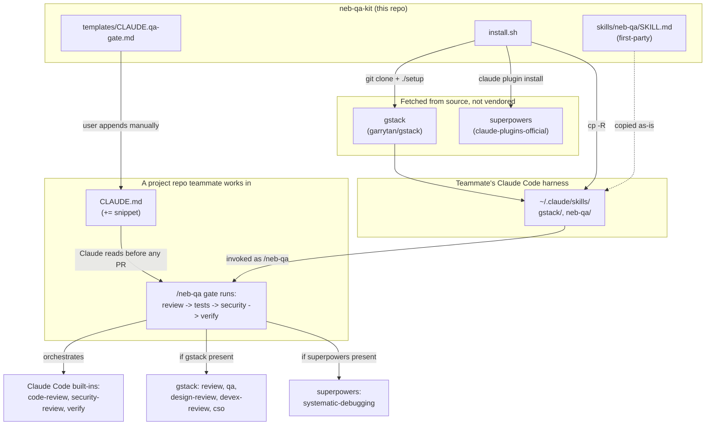

# Architecture Overview

This repo has no runtime of its own — it's a bootstrap + one skill definition.
Everything it does happens inside a teammate's Claude Code harness (`~/.claude/`)
and inside whatever project repo they later append the CLAUDE.md snippet to.

## Components and relationships

- **[install.sh](../operations/install.md)** *installs from source* → gstack
  (`git clone` from `garrytan/gstack` + its own `./setup`) and superpowers
  (`claude plugin marketplace add` + `claude plugin install`). Neither is
  vendored — install.sh always fetches the upstream, so teammates get
  whatever gstack/superpowers currently publish.
- **install.sh** *copies* `skills/neb-qa/SKILL.md` → `~/.claude/skills/neb-qa`
  (source: `install.sh:60-65`). This is the only skill this repo actually
  ships; it's Team Nebula's own IP, not vendored from anywhere.
- **[skills/neb-qa/SKILL.md](../workflows/qa-gate.md)** *orchestrates* the
  built-in Claude Code skills (`code-review`, `security-review`, `verify`)
  and, when present, gstack's skills (`review`, `qa`, `design-review`,
  `devex-review`, `cso`) and superpowers' `systematic-debugging`. It
  references them by name at run time — it does not call into their
  implementations directly, so a missing upstream skill degrades a step
  rather than breaking the gate.
- **`templates/CLAUDE.qa-gate.md`** *is copied by the user* (not by
  install.sh) into a target project's `CLAUDE.md`, via
  `cat templates/CLAUDE.qa-gate.md >> /path/to/project/CLAUDE.md`. This is
  what makes Claude proactively invoke `/neb-qa` before a PR in that project
  — the enforcement mechanism is a convention baked into the project's own
  instructions, not a hook or CI check (see design spec "Decisions").

## Design decisions worth knowing

- **Nothing upstream is vendored.** Copying gstack's or superpowers' files
  into this repo would break (gstack's skills call fixed
  `~/.claude/skills/gstack/bin/*` paths) or raise provenance/license
  questions. install.sh always re-fetches from the real source instead.
  (design spec, "Problem" section)
- **Graceful degradation is load-bearing, not incidental.** The neb-qa skill
  is written to check what's installed first and skip — never abort — steps
  whose upstream skill is missing. See
  [workflows/qa-gate.md](../workflows/qa-gate.md#preflight).
- **Enforcement is convention, not automation.** The repo deliberately does
  not wire the gate into CI or a git hook; a project only gets automatic
  `/neb-qa` runs because its CLAUDE.md says so. (design spec, "Non-goals" and
  "Decisions")
