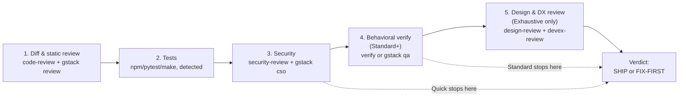

# The `/neb-qa` Gate

Defined in [skills/neb-qa/SKILL.md](../../skills/neb-qa/SKILL.md), copied to
`~/.claude/skills/neb-qa` by [install.sh](../operations/install.md). Invoked
as `/neb-qa`, or by natural-language triggers in its own frontmatter ("neb qa",
"run the qa gate", "is this ready to ship", or before creating any PR).

This skill *orchestrates* other skills — built-in Claude Code skills plus,
when present, skills from the gstack and superpowers plugins — it does not
reimplement their logic. See [architecture/overview.md](../architecture/overview.md)
for how those upstream skills get installed in the first place.

## Tiers

| Tier | Steps run |
|---|---|
| Quick | 1 Review, 2 Tests, 3 Security |
| Standard (default) | Quick + 4 Behavioral verify |
| Exhaustive | Standard + 5 Design & DX review |

Defaults to Standard; the skill suggests Exhaustive for purely UI-facing
changes. (`skills/neb-qa/SKILL.md:23-32`)

## Preflight

Before running the gate, it checks what's actually installed:

```bash
[ -d ~/.claude/skills/gstack ] && echo "gstack: yes" || echo "gstack: NO (gstack steps will be skipped)"
claude plugin list 2>/dev/null | grep -qi superpowers && echo "superpowers: yes" || echo "superpowers: NO (systematic-debugging unavailable)"
```

If an upstream tool is missing, the gate still runs its built-in pieces and
records the skipped steps in the final verdict — it never aborts the whole
gate over one missing tool. (`skills/neb-qa/SKILL.md:34-43`)

## The 5 steps



1. **Diff & static review** — built-in `code-review` (correctness bugs), then
   gstack's `review` (SQL safety, LLM trust boundaries, conditional side
   effects) if gstack is present.
2. **Tests** — auto-detects the project's test command: `npm test` (or
   `bun test` if `bun.lock` exists) for `package.json`, `pytest -q` for
   `pyproject.toml`/`pytest.ini`, `make test` for a Makefile target. No
   detected command → logged as a Medium finding. A failing test is Critical.
3. **Security** — built-in `security-review` on the diff; adds gstack's `cso`
   in daily mode if the repo has a `.gstack` dir or the user asks, and gstack
   is present.
4. **Behavioral verify** (Standard+) — built-in `verify`; swapped for gstack's
   `qa` (live browser testing) when the change is a web app with a URL
   available and gstack is present.
5. **Design & DX review** (Exhaustive only) — gstack's `design-review`
   (visual QA) and `devex-review` (developer-experience audit), if gstack is
   present.

Root-cause debugging surfaced mid-gate is handed off to superpowers'
`systematic-debugging` or gstack's `investigate` — the gate itself doesn't
try to fix bugs. (`skills/neb-qa/SKILL.md:73-75`)

Full provenance table for every skill named above:
[docs/what-each-skill-does.md](../../docs/what-each-skill-does.md).

## Verdict

```
NEB QA — <tier> tier
  Review:   <n critical / n high / n medium / n low>
  Tests:    <pass | FAIL: ...>
  Security: <n critical / n high / ...>
  Verify:   <pass | fail | skipped: reason>
  Skipped:  <steps skipped because a tool was absent>

VERDICT: SHIP  ✅      (only if zero Critical and zero High)
   -or-  FIX-FIRST ⛔   (list every Critical/High to resolve)
```

SHIP is gated on zero Critical and zero High findings across every step that
ran. (`skills/neb-qa/SKILL.md:77-93`)

## What triggers it automatically

Once a project's `CLAUDE.md` has the snippet from
`templates/CLAUDE.qa-gate.md` appended (see
[architecture/overview.md](../architecture/overview.md)), Claude is instructed
to run `/neb-qa` before opening any PR in that project and to never open one
while the verdict is FIX-FIRST, defaulting to Standard tier / Exhaustive for
UI changes.
